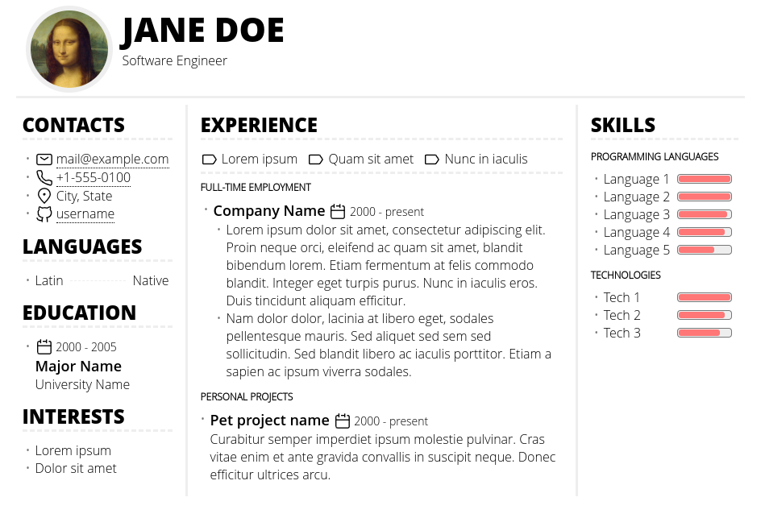

CV-template
===========
Minimalistic template for software developer CV document. It's implemented as
Jinja template with YAML data, so any Jinja-compatible generator should work to
generate resulting HTML.

How to build
------------
First, clone the repo and fill data fields in ``data.yaml`` file.

Supplied ``Makefile`` uses `tera-cli <https://github.com/guangie88/tera-cli>`_.
In case you have it installed, run:

  make

It will create ``cv.html`` file in root directory.

To build using ``j2cli``:

  pip install j2cli[yaml]
  j2 -o cv.html template.html data.yaml
